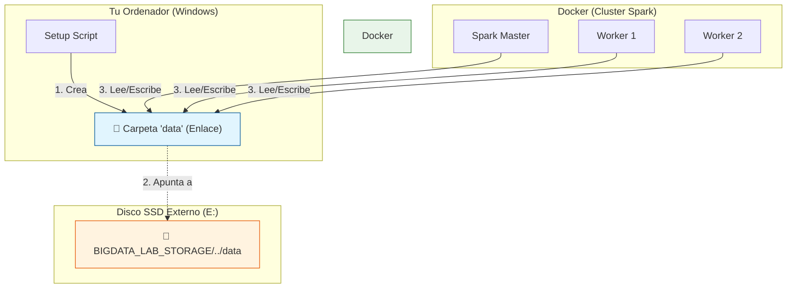
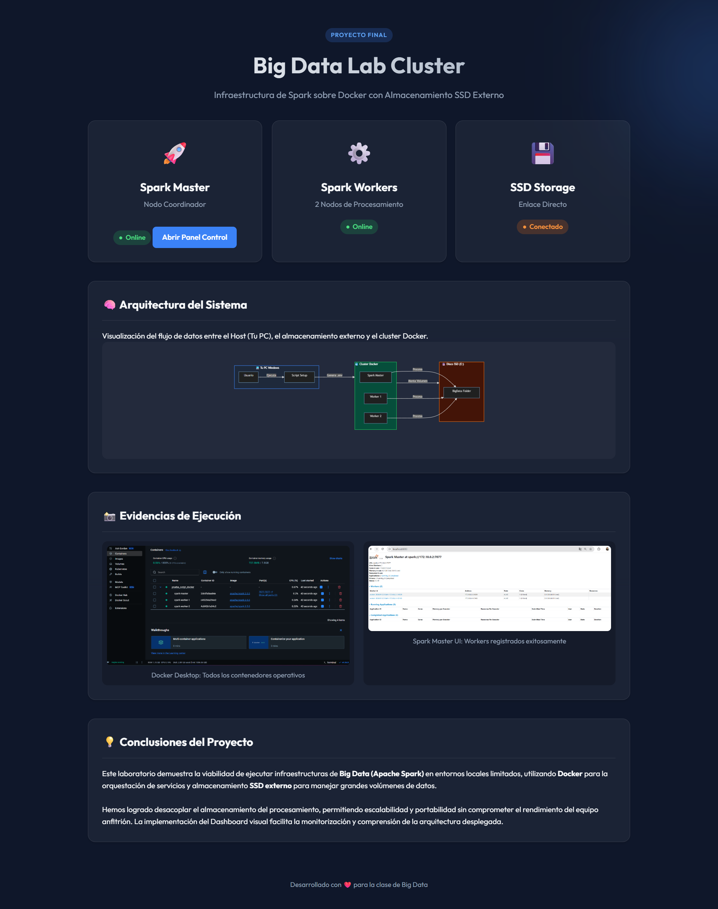

# 🎓 Laboratorio Big Data (Docker + SSD)

Este proyecto despliega un cluster de **Apache Spark** (Master + 2 Workers) utilizando Docker. Está diseñado para trabajar con grandes volúmenes de datos almacenados externamente en un disco SSD para no saturar tu ordenador.

## 📋 Requisitos Previos

Antes de empezar, asegúrate de tener:
1.  **Docker Desktop** instalado y ejecutándose (con el ícono de la ballena verde/blanco en la barra de tareas).
2.  Un **Disco SSD Externo** conectado (recomendado usar la letra **E:**).
3.  **PowerShell** (viene con Windows).

---

## 🧠 ¿Cómo funciona este Laboratorio?

Este proyecto crea un **puente** entre Docker y tu Disco Externo para que puedas procesar muchos datos sin llenar tu disco `C:`.



1.  **El Script** crea una carpeta especial (`data` en tu proyecto) que actúa como un "portal".
2.  Este "portal" apunta realmente a tu **Disco SSD Externo**.
3.  **Docker** se conecta a ese "portal". Todo lo que guardes en Docker aparecerá mágicamente en tu SSD.

### 🔧 Detalles Técnicos Importantes

#### 1. ¿Por qué usamos un archivo `.env`?
Docker en Windows a veces tiene problemas para entender los "atajos" (Junctions). Para evitar errores como "file exists", el script genera automáticamente un archivo oculto `.env`.
*   **¿Qué hace?**: Guarda la **ruta real y exacta** de tu disco SSD (ej: `E:\BIGDATA...`).
*   **Beneficio**: Al usar esta ruta real, Docker monta el disco directamente sin confundirse con el atajo, garantizando estabilidad total.

#### 2. Dashboard del Proyecto (Web)
Hemos incluido una página web local (`localhost:8081`) para facilitar la presentación del proyecto.
*   **Contenedor**: Usa `Nginx`, un servidor web ultraligero.
*   **Propósito**: Mostrar visualmente la arquitectura y las evidencias de que el cluster está funcionando, ideal para explicárselo a profesores o compañeros.

---

## 🚀 Instalación Paso a Paso

Si eres nuevo, sigue estos pasos exactos:

### 1. Preparar la Carpeta
Descarga los archivos del proyecto (`setup_ssd_bigdata_v3.ps1` y `docker-compose.yml`) en una carpeta, por ejemplo `Descargas` o una carpeta nueva llamada `MiLaboratorio`.

### 2. Ejecutar el Script de Configuración
Este script crea las conexiones "mágicas" para que Docker pueda ver tu disco SSD como si fuera una carpeta local.

1.  Abre el menú Inicio, busca **PowerShell**, clic derecho y **"Ejecutar como administrador"**.
2.  Navega a la carpeta donde tienes los archivos. Por ejemplo:
    ```powershell
    cd C:\Users\alexi\Downloads
    ```
    *(Ajusta la ruta si los guardaste en otro sitio)*
3.  Ejecuta el script de instalación:
    ```powershell
    powershell -ExecutionPolicy Bypass -File .\setup_ssd_bigdata_v3.ps1
    ```
4.  El script te preguntará la letra de tu disco SSD. Si es **E**, solo presiona **Enter**.

### 3. Encender el Laboratorio
Una vez que el script termine (te dirá "Listo"), ejecuta este comando para descargar y encender los servidores de Spark:

```powershell
docker compose up -d
```
*Esto puede tardar unos minutos la primera vez mientras descarga las herramientas.*

---

## ✅ ¿Cómo sé si funciona?

1.  Abre tu navegador web favorito (Chrome, Edge, etc.).
2.  Entra a: [http://localhost:8080](http://localhost:8080)
3.  Deberías ver una pantalla que dice **"Spark Master at spark://..."**.
4.  Busca la línea **"Alive Workers:"**. Si dice **2**, ¡Felicidades! Todo funciona.

---

## 🛑 Apagar el Laboratorio

Cuando termines de trabajar y quieras liberar memoria RAM en tu PC, ejecuta:

```powershell
docker compose down
```

---

## 🔄 Aplicar Cambios (Reiniciar Todo)

Si modificas el código (ej: cambios en `docker-compose.yml` o configuraciones), usa estos comandos para asegurarte de que Docker aplique los cambios limpiamente:

1.  **Detener y eliminar contenedores**:
    ```powershell
    docker compose down
    ```

2.  **Forzar recreación de contenedores**:
    ```powershell
    docker compose up -d --force-recreate
    ```
    *Esto obliga a Docker a reconstruir la configuración, útil si algo falla o cambiaste puertos/volúmenes.*

---

## 🛠️ Solución de Problemas Comunes

*   **Error "execution of scripts is disabled..."**: Asegúrate de usar el comando largo del paso 2.3 que incluye `-ExecutionPolicy Bypass`.
*   **Error "docker not found"**: Docker Desktop no está abierto. Búscalo en Inicio y ábrelo primero.
*   **Error con imagen "bitnami"**: Si Docker falla al descargar, revisa el archivo `docker-compose.yml` y asegúrate de que dice `image: apache/spark:3.5.0` (o `latest`).

---

**¡Disfruta aprendiendo Big Data!** 🐘

---

## 📸 Resultados y Evidencias

Aquí está la prueba de que el laboratorio funciona correctamente:

### 1. Contenedores Ejecutándose (Docker Desktop)
Se muestra el estado "Running" (verde) para todos los servicios.


### 2. Spark Master UI
Accesible en `http://localhost:8080`, mostrando los 2 Workers registrados y listos.


### 3. Dashboard del Proyecto
Accesible en `http://localhost:8081`. Muestra la arquitectura, el estado de los servicios y evidencia visual.



---

## 📜 Resumen de Comandos Ejecutados

Estos son los comandos exactos que utilizamos para lograr este despliegue exitoso:

1.  **Ejecutar Script de Configuración (PowerShell Admin)**
    ```powershell
    cd C:\Users\alexi\Downloads\Prueba_Script_Docker
    .\setup_ssd_bigdata_v3.ps1
    ```
    *Durante la ejecución, seleccionamos el disco correcto (ej: E).*

2.  **Iniciar Docker**
    ```powershell
    docker compose up -d
    ```

3.  **Verificar Logs (Opcional)**
    ```powershell
    docker compose logs -f
    ```

