# 🎓 Laboratorio Big Data (Docker + SSD)

Este proyecto despliega un cluster de **Apache Spark** (Master + 2 Workers) utilizando Docker. Está diseñado para trabajar con grandes volúmenes de datos almacenados externamente en un disco SSD para no saturar tu ordenador.

## 📋 Requisitos Previos

Antes de empezar, asegúrate de tener:
1.  **Docker Desktop** instalado y ejecutándose (con el ícono de la ballena verde/blanco en la barra de tareas).
2.  Un **Disco SSD Externo** conectado (recomendado usar la letra **E:**).
3.  **PowerShell** (viene con Windows).

---

## 🧠 ¿Cómo funciona este Laboratorio?

Este proyecto no solo es un clúster de Spark, es un **Ecosistema de Datos Completo** que conecta tu hardware físico (SSD) con herramientas de procesado masivo.

```mermaid
graph TD
    subgraph "1. Ingesta (Internet)"
        Web["🌐 Football-Data.co.uk"] -- "Descarga" --> Prepare["🐍 prepare_data.py"]
    end

    subgraph "2. Almacenamiento (Disco SSD)"
        Prepare -- "Mapeo" --> RealFolder["📂 BIGDATA_LAB_STORAGE/../data"]
        RealFolder -- "Consolida" --> CSV["📄 laliga_history.csv"]
    end

    subgraph "3. Motores de Procesamiento (Docker)"
        CSV --> MR["🐘 Hadoop MapReduce (mrjob)"]
        CSV --> SP["🚀 Spark SQL (PySpark)"]
        MR --> Report1["📄 final_report.txt"]
        SP --> Report2["📄 spark_reporte.txt"]
    end

    subgraph "4. Presentación (Web)"
        CSV --> Dash["📊 Dashboard Interactivo (localhost:8081)"]
        Report1 -.-> Dash
        Report2 -.-> Dash
    end

    style RealFolder fill:#fff3e0,stroke:#e65100
    style Docker fill:#e8f5e9,stroke:#2e7d32
    style Dash fill:#e1f5fe,stroke:#01579b
```



### ¿Qué ocurre "bajo el capó"?

1.  **Ingesta Inteligente**: El script `prepare_data.py` descarga automáticamente las últimas 15 temporadas de La Liga, las limpia y las une en un único archivo gigante en tu **SSD**.
2.  **Puente de Memoria**: Docker utiliza un archivo `.env` para saber exactamente dónde está tu SSD, montando los datos sin ocupar espacio en tu disco `C:`.
3.  **Procesamiento Híbrido**: 
    *   **Clásico**: Usamos `mrjob` para emular el corazón de Hadoop (MapReduce) y calcular récords históricos.
    *   **Moderno**: Usamos `Spark SQL` para lanzar consultas "estilo base de datos" de alta velocidad sobre millones de registros.
4.  **Visualización**: Todo se conecta a un servidor **Nginx** que sirve un Dashboard interactivo, donde puedes filtrar temporadas y ver los resultados en gráficos dinámicos.

#### 🔧 Detalles Técnicos Importantes

#### 1. ¿Por qué usamos un archivo `.env`?
Docker en Windows a veces tiene problemas para entender los "atajos" (Junctions). Para evitar errores como "file exists", el script genera automáticamente un archivo oculto `.env`.
*   **¿Qué hace?**: Guarda la **ruta real y exacta** de tu disco SSD (ej: `E:\BIGDATA...`).
*   **Beneficio**: El clúster de Spark ve el disco directamente, garantizando estabilidad total.

#### 2. Dashboard del Proyecto (Web)
Hemos incluido una página web local (`localhost:8081`) para facilitar la presentación del proyecto.
*   **Contenedor**: Usa `Nginx`, un servidor web ultraligero.
*   **Propósito**: Mostrar visualmente la arquitectura y las evidencias de que el cluster está funcionando, ideal para explicárselo a profesores o compañeros.

---

## 🚀 Instalación Paso a Paso

Si eres nuevo, sigue estos pasos exactos:

### 1. Preparar la Carpeta
Descarga los archivos del proyecto (`setup_ssd_bigdata_v3.ps1` y `docker-compose.yml`) en una carpeta, por ejemplo `Descargas` o una carpeta nueva llamada `MiLaboratorio`.

### 2. Ejecutar el Script de Configuración
Este script crea las conexiones "mágicas" para que Docker pueda ver tu disco SSD como si fuera una carpeta local.

1.  Abre el menú Inicio, busca **PowerShell**, clic derecho y **"Ejecutar como administrador"**.
2.  Navega a la carpeta donde tienes los archivos. Por ejemplo:
    ```powershell
    cd C:\Users\alexi\Downloads
    ```
    *(Ajusta la ruta si los guardaste en otro sitio)*
3.  Ejecuta el script de instalación:
    ```powershell
    powershell -ExecutionPolicy Bypass -File .\setup_ssd_bigdata_v3.ps1
    ```
4.  El script te preguntará la letra de tu disco SSD. Si es **E**, solo presiona **Enter**.

### 3. Encender el Laboratorio
Una vez que el script termine (te dirá "Listo"), ejecuta este comando para descargar y encender los servidores de Spark:

```powershell
docker compose up -d
```
*Esto puede tardar unos minutos la primera vez mientras descarga las herramientas.*

---

## ✅ ¿Cómo sé si funciona?

1.  Abre tu navegador web favorito (Chrome, Edge, etc.).
2.  Entra a: [http://localhost:8080](http://localhost:8080)
3.  Deberías ver una pantalla que dice **"Spark Master at spark://..."**.
4.  Busca la línea **"Alive Workers:"**. Si dice **2**, ¡Felicidades! Todo funciona.

---

## 🛑 Apagar el Laboratorio

Cuando termines de trabajar y quieras liberar memoria RAM en tu PC, ejecuta:

```powershell
docker compose down
```

---

## 🔄 Aplicar Cambios (Reiniciar Todo)

Si modificas el código (ej: cambios en `docker-compose.yml` o configuraciones), usa estos comandos para asegurarte de que Docker aplique los cambios limpiamente:

1.  **Detener y eliminar contenedores**:
    ```powershell
    docker compose down
    ```

2.  **Forzar recreación de contenedores**:
    ```powershell
    docker compose up -d --force-recreate
    ```
    *Esto obliga a Docker a reconstruir la configuración, útil si algo falla o cambiaste puertos/volúmenes.*

---

## 🛠️ Solución de Problemas Comunes

*   **Error "execution of scripts is disabled..."**: Asegúrate de usar el comando largo del paso 2.3 que incluye `-ExecutionPolicy Bypass`.
*   **Error "docker not found"**: Docker Desktop no está abierto. Búscalo en Inicio y ábrelo primero.
*   **Error con imagen "bitnami"**: Si Docker falla al descargar, revisa el archivo `docker-compose.yml` y asegúrate de que dice `image: apache/spark:3.5.0` (o `latest`).

---

**¡Disfruta aprendiendo Big Data!** 🐘

---

## 📸 Resultados y Evidencias

Aquí está la prueba de que el laboratorio funciona correctamente:

### 1. Contenedores Ejecutándose (Docker Desktop)
Se muestra el estado "Running" (verde) para todos los servicios.


### 2. Spark Master UI
Accesible en `http://localhost:8080`, mostrando los 2 Workers registrados y listos.


### 3. Dashboard del Proyecto
Accesible en `http://localhost:8081`. Muestra la arquitectura, el estado de los servicios y evidencia visual.


### 4. Módulo de Hadoop (Analítica Avanzada)
Nuevo módulo de análisis de datos históricos (La Liga 2009-2024) usando MapReduce.

*   **Script de Análisis**: Ubicado en `hadoop_lab/run_analysis.ps1`. Descarga datos y genera estadísticas.
*   **Dashboard Interactivo**: Accesible en `http://localhost:8081/hadoop.html`.
    *   Permite filtrar por años y ver gráficas de Goles, Tarjetas y Victorias.

---

## 💻 Ejecución Manual (Alternativa)

Si la ejecución automática falla o prefieres hacerlo paso a paso, utiliza estos comandos en una terminal de **PowerShell como Administrador**.

⚠️ **Nota Importante sobre la Ruta:**
El comando `cd` de abajo es solo un **ejemplo/referencia**. Debes cambiarlo por la ruta real donde tú tengas guardada la carpeta `Prueba_Script_Docker` en tu PC.

```powershell
# 1. Ir a la carpeta de tu proyecto (¡AJUSTA ESTA RUTA A LA TUYA!)
cd "C:\Users\amendoza\.gemini\antigravity\scratch\Prueba_Script_Docker"

# 2. Ejecutar el script (ahora sí funcionará el enlace y .env)
# Si te sale error de "scripts disabled", usa este comando especial:
powershell -ExecutionPolicy Bypass -File .\setup_ssd_bigdata_v3.ps1

```powershell
# 3. Levantar Docker (si el script no lo hizo ya)
docker compose up -d
```

---

## 🔄 Cómo Actualizar (Desde GitHub)

Si en el futuro hago cambios en el repositorio y quieres bajarlos a tu PC:

### Opción 1: Actualización Normal
Usa esto si solo quieres traer lo nuevo:
```powershell
git pull origin main
```

### Opción 2: Forzar Sincronización (Si algo falla)
Usa esto si tienes errores o quieres estar 100% igual que la nube (⚠️ Borra tus cambios locales no guardados):
```powershell
git fetch --all
git reset --hard origin/main
```

---

## 💾 Cómo Guardar tus Cambios (Subir a GitHub)

Cada vez que modifiques código o documentación y quieras guardarlo en la nube:

```powershell
git add .
git commit -m "Escribe aquí qué cambiaste"
git push
```
*(Si es la primera vez en una sesión nueva, GitHub podría pedirte credenciales).*

---

## 📊 Resumen del Módulo Hadoop & Spark SQL

Como mejora final, se ha integrado un ecosistema completo de análisis de Big Data:

1.  **Hadoop MapReduce (Python)**: Procesamiento clásico de goles, tarjetas y victorias usando `mrjob`.
2.  **Spark SQL (Docker)**: Análisis moderno de alto nivel con consultas SQL distribuidas en el clúster.
3.  **Dashboard Interactivo**: Visualización profesional en tiempo real con filtros por temporada.
### 🛠️ Comandos de Ejecución
Si quieres lanzar los análisis manualmente desde la terminal:

*   **Hadoop (MapReduce)**:
    ```powershell
    powershell -File hadoop_lab/run_analysis.ps1
    ```
*   **Spark SQL (Clúster)**:
    ```powershell
    docker exec -it spark-master /opt/spark/bin/spark-submit /opt/spark/scripts/spark_analysis.py
    ```

> [!TIP]
> **¿Quieres saber más?** Si deseas ver el manual técnico completo, el flujo de datos detallado y cómo ejecutar las consultas SQL avanzadas, consulta el archivo:
> 👉 **[Doc_Hadoop.md](./hadoop_lab/Doc_Hadoop.md)**

---

## 🚀 Guía Rápida (Para nuevas PCs o Clones)

Si acabas de clonar este proyecto o vas a usarlo en un ordenador nuevo, sigue estos 4 pasos críticos:

1.  **Conecta tu SSD**: Asegúrate de que el disco esté conectado (preferiblemente letra **E:**).
2.  **Configura el "Portal" (Junction)**: Ejecuta PowerShell como **Administrador** en la carpeta del proyecto y lanza:
    ```powershell
    powershell -ExecutionPolicy Bypass -File .\setup_ssd_bigdata_v3.ps1
    ```
3.  **Inicia el Clúster**:
    ```powershell
    docker compose up -d
    ```
4.  **Verifica y Disfruta**:
    *   Dashboard: [http://localhost:8081](http://localhost:8081)
    *   Spark Master: [http://localhost:8080](http://localhost:8080)

---

**¡Disfruta aprendiendo Big Data!** 🐘🚀
