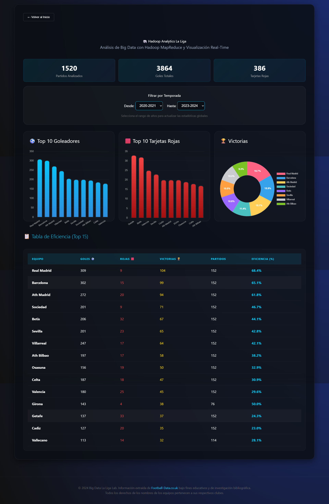

# 🐘 Módulo de Hadoop: Análisis de Big Data de La Liga

Este módulo simula un entorno de **Hadoop** utilizando Python para procesar grandes volúmenes de datos históricos de la liga española de fútbol. 

## 1. ¿Qué es Hadoop y por qué es necesario?

**Hadoop** es un framework de código abierto que permite el almacenamiento y procesamiento distribuido de grandes conjuntos de datos (Big Data) a través de clústeres de computadoras. 

### ¿Por qué lo usamos aquí?
En el mundo real, los datos de deportes no se limitan a un solo archivo .csv. Imagina procesar cada pase, cada posición de GPS de 22 jugadores durante 90 minutos, en miles de partidos por temporada en todo el mundo.
- **Escalabilidad**: Hadoop permite procesar petabytes de datos que no cabrían en la memoria de un solo ordenador.
- **MapReduce**: Es el modelo de programación que usamos. Divide el problema en dos pasos (Map y Reduce).

### La Librería: mrjob
Para implementar el modelo MapReduce sin necesidad de programar en Java (el lenguaje nativo de Hadoop), hemos utilizado **`mrjob`**. 
- **¿Qué hace?**: Permite escribir scripts de MapReduce en Python puro. 
- **Uso en este lab**: Se utiliza en `football_analysis_mr.py` y `advanced_stats_mr.py` para definir los pasos de mapeo (extraer datos de cada fila del CSV) y reducción (sumar y agrupar resultados por equipo). 
- **Ventaja**: Facilita la ejecución de los trabajos tanto en local como en clústeres reales de Hadoop/EMR sin cambiar el código.

### Relación con herramientas comunes (Hive, Pig, HBase)
Aunque en este laboratorio hemos programado el **MapReduce directamente en Python**, es importante saber cómo se relaciona con las herramientas más famosas del ecosistema Hadoop:

1.  **Apache Hive**: Permite hacer consultas tipo SQL (`SELECT...`) sobre Hadoop. Lo que hemos hecho en `advanced_stats_mr.py` es exactamente lo que Hive haría "por debajo": transformar una consulta de base de datos en código MapReduce.
2.  **Apache Pig**: Es un lenguaje de flujo de datos. Mientras Pig usa un lenguaje llamado Pig Latin, nosotros usamos la librería `mrjob` de Python, que simplifica el flujo de datos de forma similar.
3.  **Apache HBase**: Es una base de datos NoSQL para acceso en tiempo real. En este lab no la usamos porque nuestros datos son estáticos (archivos CSV), pero en un entorno profesional, los resultados del análisis podrían guardarse en HBase para ser consultados instantáneamente.

---

## 2. Estructura de la Carpeta `hadoop_lab`

A continuación, se detalla la función de cada archivo contenido en esta carpeta:

| Archivo | Tipo | Descripción |
| :--- | :--- | :--- |
| `requirements.txt` | Config | Lista de librerías necesarias (`mrjob`, `pandas`, `requests`). |
| `prepare_data.py` | Python | **Extractor**: Descarga datos desde Football-Data.co.uk y los unifica en un solo archivo maestro. |
| `football_analysis_mr.py`| Python | **MapReduce Básico**: Script inicial de prueba para contar goles totales por equipo. |
| `advanced_stats_mr.py` | Python | **MapReduce Avanzado**: El "motor" principal. Calcula goles, tarjetas rojas y victorias simultáneamente. |
| `analyze_results.py` | Python | **Procesador**: Lee la salida bruta de Hadoop y genera rankings legible en la terminal. |
| `final_stats.py` | Python | **Reportador**: Genera el informe final del MapReduce. |
| `spark_analysis.py` | Python | **Spark SQL**: Análisis avanzado usando SQL sobre el clúster. |
| `spark_reporte.txt` | Texto | **Informe Spark**: Resultado de las consultas SQL avanzadas. |
| `run_analysis.ps1` | PowerShell | **Orquestador**: Automatiza el flujo completo de MapReduce. |

---

## 3. Flujo de Información (Compilación de Datos)

### A. Flujo de Hadoop (MapReduce Clásico)
1.  **Entrada**: `laliga_history.csv`.
2.  **`football_analysis_mr.py`** ➡️ Genera **`resultados.txt`** (conteo simple de goles).
3.  **`advanced_stats_mr.py`** ➡️ Genera **`advanced_results.txt`** (datos "raw" de Hadoop).
4.  **`final_stats.py`** ➡️ Genera **`final_report.txt`** (resumen final legible).

### B. Flujo de Spark (Análisis Moderno)
1.  **Entrada**: `laliga_history.csv`.
2.  **`spark_analysis.py`** ➡️ Los resultados se ven en consola por defecto.
3.  **Redirección de salida** ➡️ Si usas `> hadoop_lab/spark_results.txt` o `spark_reporte.txt`, guardas las tablas de SQL en esos archivos para persistencia.

---

## 4. Integración con el Dashboard
Los datos procesados en `laliga_history.csv` son los mismos que consume el **Dashboard Interactivo** (`www/hadoop.html`), permitiendo que la visualización web sea siempre fiel a los datos analizados por el motor de Hadoop.

## 5. Análisis Moderno: Spark SQL (Alternativa a Hive)

Para este módulo hemos utilizado **PySpark** y el motor de **Spark SQL**, que permite procesar datos distribuidos utilizando el lenguaje SQL estándar, tal como se haría profesionalmente con Apache Hive.

### Herramientas y Librerías:
- **PySpark**: API de Python para Apache Spark.
- **Spark SQL**: Motor para el procesamiento de datos estructurados.
- **Spark Master/Workers**: Clúster distribuido corriendo en contenedores Docker.

### Cómo ejecutar el análisis:
> [!IMPORTANT]
> **Antes de empezar**: Si has cerrado la terminal, primero debes situarte en la carpeta del proyecto. De lo contrario, los archivos de reporte no se guardarán en el sitio correcto.
> ```powershell
> cd c:\Users\alexi\Downloads\Prueba_Script_Docker
> ```

1. Abrir una terminal en la raíz del proyecto (ver nota arriba).
2. Ejecutar el comando para procesar y guardar el reporte:
   ```powershell
   docker exec spark-master /opt/spark/bin/spark-submit /opt/spark/scripts/spark_analysis.py > hadoop_lab/spark_reporte.txt
   ```

### Consultas Implementadas:
El script `spark_analysis.py` ejecuta consultas complejas de nivel profesional:
- **Top 10 Goles**: Análisis global de ataque.
- **Top 5 Rojas**: Análisis de disciplina.
- **Eficiencia Global**: Relación victorias/partidos.
- **Especialistas Visitantes**: SQL Complejo que filtra y calcula el % de victorias solo fuera de casa.
- **Evolución por Temporada**: Agrupación temporal para detectar tendencias de promedio de gol.

### Monitoreo (Spark Web UI):
Mientras el clúster está encendido, puedes entrar a [http://localhost:8080](http://localhost:8080) para ver:
- El estado de los Workers.
- Las aplicaciones completadas (`LaLigaSparkSQL_Advanced`).
- El tiempo de ejecución y recursos utilizados.

---

## 6. Visualización Final (Dashboard)

El resultado final de todos estos análisis se puede visualizar de forma interactiva en la interfaz web del proyecto.

### Acceso Directo:
👉 **[http://localhost:8081/hadoop.html](http://localhost:8081/hadoop.html)**

### Vista Previa:


---

> **Nota de Copyright**: Los datos utilizados en este laboratorio son propiedad de [Football-Data.co.uk](https://www.football-data.co.uk) y se utilizan exclusivamente con fines educativos y de demostración técnica.
